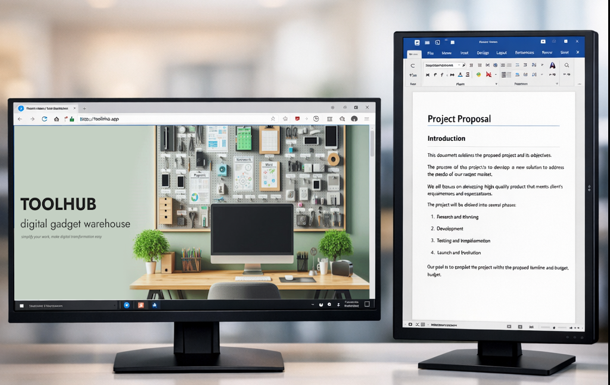
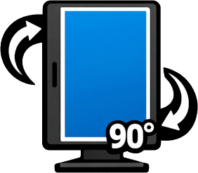
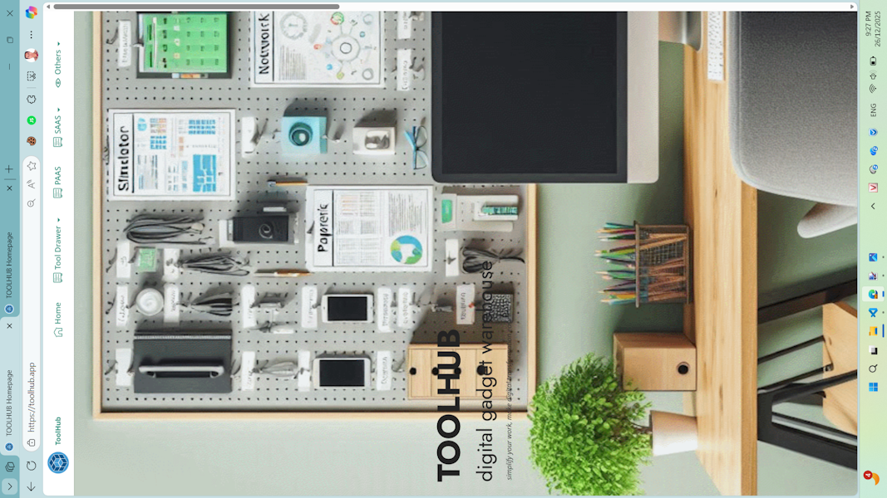

# RORATE DISPLAY
  
  Tự động phát hiện màn hình phụ và xoay ngược chiểu kim đồng 90 sau mỗi lượt chạy, hoặc có thể chỉ định chính xác góc quay (chẵn 90*). Tự xác định vị trí tương đối của màn hình phụ so với màn hình chính
  

## Hướng dẫn sử dụng

Lưu ý: nếu gọi chương trình này từ Terminal, thì phải bảo đảm rằng Terminal đó được mở sau khi đã cắm màn hình phụ. Lý do là Terminal chỉ detect trạng thái các màn hình lúc khởi tạo phiên và truyền tham số đó cho ứng dụng.  

Đổi góc quay của màn hình phụ theo các góc 0, 90, 180, 270 độ, đồng thời ước lượng vị trí tương đối so với màn hình chính
Trường hợp chỉ có màn hình chính, chương trình sẽ quay màn hình chính.

```shell
  .\Rotate.ps1 [ 0 | 1 | 2 | 3 | 4]
```

  
  

Đổi góc quay của màn hình phụ theo các góc tiếp theo. Ví dụ nếu góc hiện tại là 90 thì góc tiếp theo là 180..

```shell
  .\Rotate.ps1
```

Icon: 

